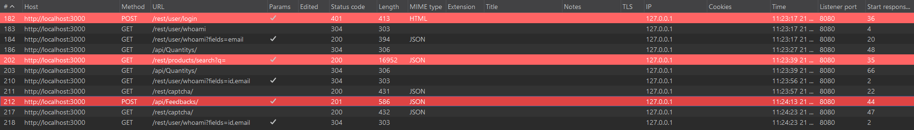
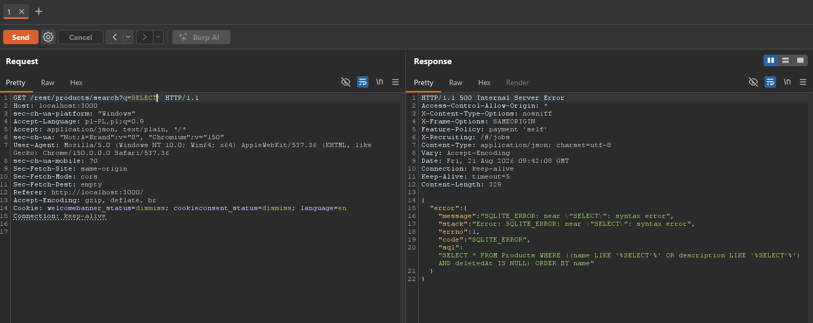
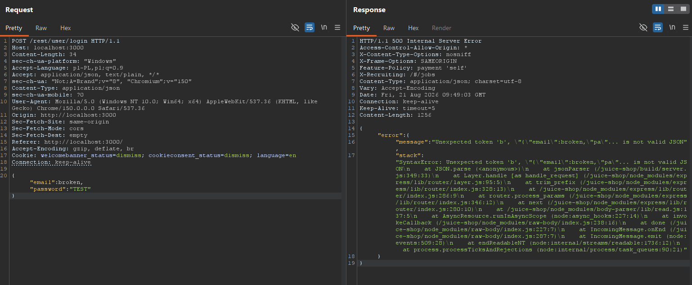
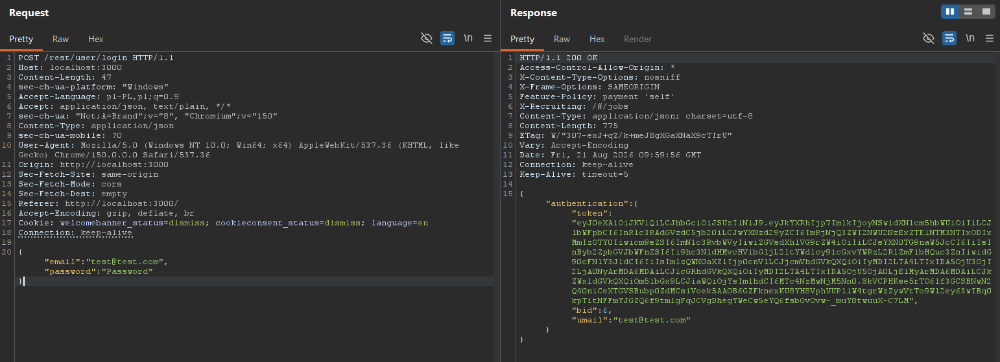

# Phase 1: Reconnaissance & Attack Surface Mapping

## 1. Objective
Identify exposed endpoints, user-controlled input vectors, and underlying technologies powering the target application without performing destructive actions.

---

## 2. Attack Surface Identification (Endpoints & Parameters)
Network traffic generated during the manual walkthrough of key application workflows was captured using Burp Suite Community. Request analysis revealed the following interactive API endpoints accepting user-controlled input:

| Endpoint | HTTP Method | Parameter(s) | Input Type | Business Function |
| :--- | :--- | :--- | :--- | :--- |
| `/rest/products/search` | `GET` | `q` | URL Query String | Product catalog search engine |
| `/rest/user/login` | `POST` | `email`, `password` | JSON Body | User authentication & session generation |
| `/api/Feedbacks` | `POST` | `comment`, `rating` | JSON Body | Customer review submissions |



---

## 3. Technology Fingerprinting & Evidence

Target architecture components were identified through response header inspection, active error triggering (fuzzing), and return payload analysis.

### A. Database Engine: SQLite
* **Detection Method:** Injected an inaccurate SQL keyword (`SELECT'`) into the search parameter (`GET /rest/products/search?q=SELECT'`).
* **Evidence:** The application leaked raw database exception messages directly in the response:
  ```json
  "message": "SQLITE_ERROR: near \"SELECT\": syntax error"
  ```
* **Disclosed Query Structure:**
  ```sql
  SELECT * FROM Products WHERE ((name LIKE '%SELECT%' OR description LIKE '%SELECT%') AND deletedAt IS NULL) ORDER BY name
  ```



---

### B. Backend Environment: Node.js / Express
* **Detection Method:** Sent a malformed JSON payload to the `/rest/user/login` endpoint to trigger an unhandled internal exception (`500 Internal Server Error`).
* **Evidence:** The leaked server call stack (*stack trace*) exposed internal filesystem paths referencing the Node.js runtime and Express framework modules:
  * `/juice-shop/node_modules/express/`
  * `/juice-shop/node_modules/body-parser/`



---

### C. Authentication Protocol: JSON Web Tokens (JWT)
* **Detection Method:** Inspected a successful authentication response (`200 OK`).
* **Evidence:** The server issues a stateless identity token following the standard three-segment base64-encoded JWT structure prefixed with `eyJ...`:
  ```json
  "token": "eyJ0eXAiOiJKV1QiLCJ..."
  ```



---

## 4. Prioritization for Phase 2 (Exploitation)

The identified endpoints will be targeted to demonstrate practical impact across the **CIA Triad**:

1. **Catalog Search (`GET /rest/products/search?q=`):**
   * **Confidentiality [C]:** Execute a `UNION SELECT` attack to extract user credentials (`email`, `password`) directly from the database into the search results.
   * **Availability [A]:** Inject heavy compute queries to induce server latency and simulate a Denial of Service (DoS).

2. **User Authentication (`POST /rest/user/login`):**
   * **Integrity [I]:** Exploit SQL injection (`' OR 1=1--`) to bypass authentication and gain unauthorized administrative access.
